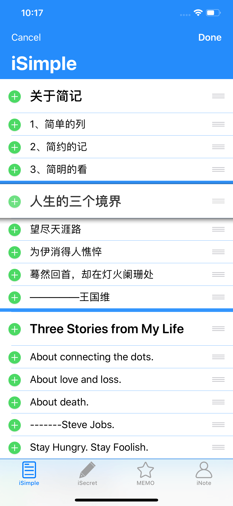
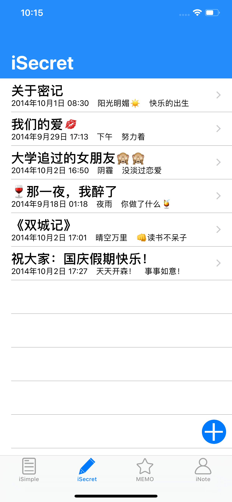
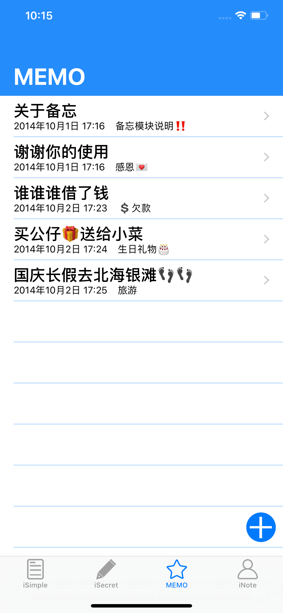
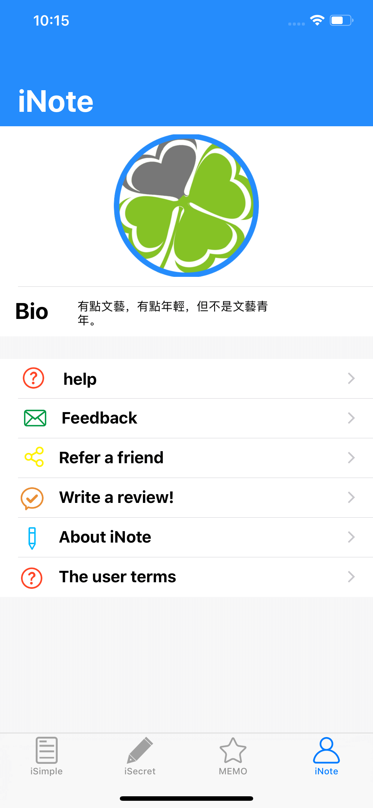
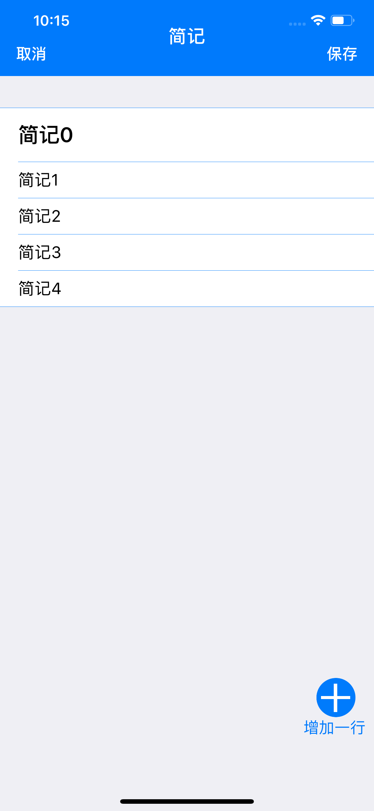
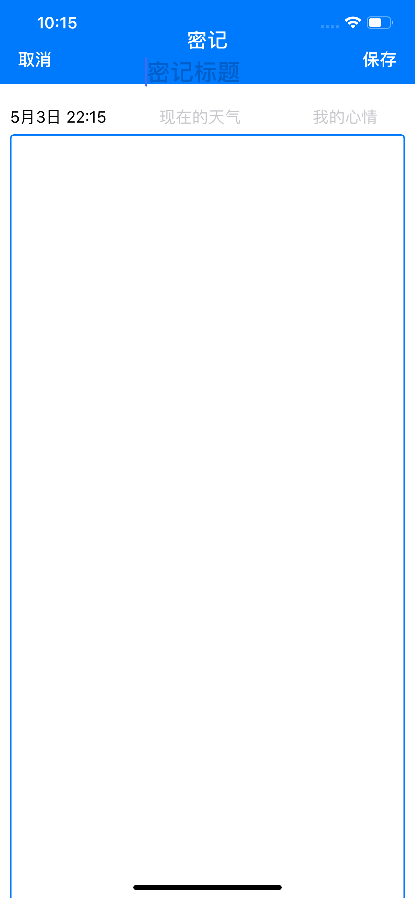
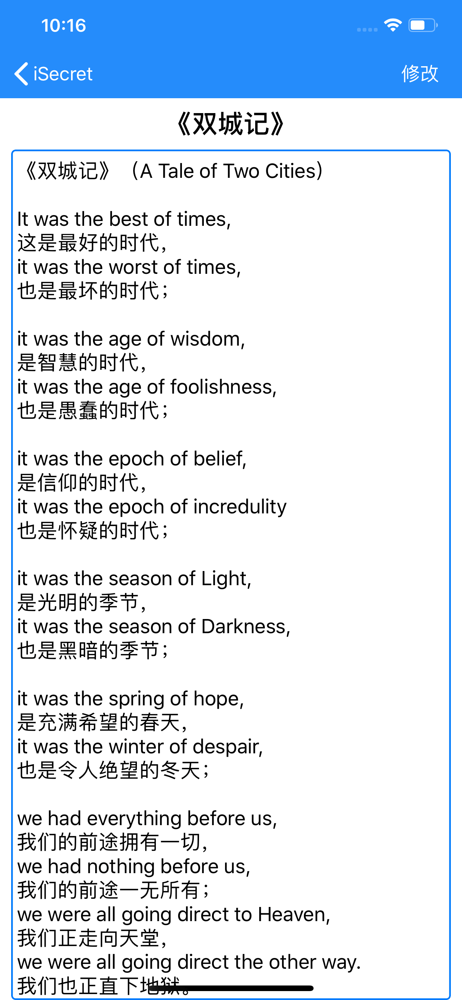

# SecurityNote
### 项目介绍
密记iOS版，第一个开发的完整iOS应用，本应用主要功能是简单笔记。

The application of the main function is a simple notes.

### 项目学习
本应用主要是学习到TableView的使用和Sqlite数据库使用，使用了第三方库FMDB、MBProgressHUD。

### 下载地址
[iOS App Store](https://itunes.apple.com/cn/app/inotes/id925021570?l=zh&ls=1&mt=8&action=write-review)

### 应用截图

